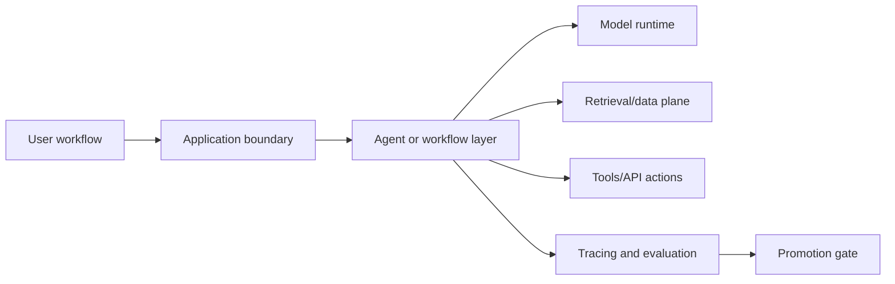

# Architecture Decision Record

## Decision

Short name:

Status: Proposed / Accepted / Deprecated / Superseded

Date:

Owner:

## Context

Describe the product workflow, users, operating environment, and constraints.

Key constraints:

- Latency:
- Throughput:
- Cost:
- Security:
- Data residency:
- Model/provider constraints:
- Team skill constraints:

## Options Considered

| Option | Description | Strengths | Weaknesses | Decision |
| --- | --- | --- | --- | --- |
| Option A |  |  |  |  |
| Option B |  |  |  |  |
| Option C |  |  |  |  |

## Chosen Architecture

## Consequences

Positive consequences:

- 

Trade-offs accepted:

- 

Operational consequences:

- 

## Evidence Required

| Claim | Evidence | Owner | Due Date |
| --- | --- | --- | --- |
| Quality improves | Evaluation dataset and score delta |  |  |
| Latency is acceptable | Load test and p95/p99 results |  |  |
| Retrieval is grounded | Retrieval eval and citation audit |  |  |
| Tools are safe | Security/governance review |  |  |

## Failure Modes

| Failure Mode | Detection | Mitigation | Rehearsal |
| --- | --- | --- | --- |
|  |  |  |  |

## Review Checklist

- [ ] The decision maps to a clear architecture layer.
- [ ] Alternatives are real, not strawmen.
- [ ] Evidence is measurable.
- [ ] Security and privacy impact are included.
- [ ] Rollback path is defined.
- [ ] Owner and review date are defined.

## Filling Guidance

Write the context in business and engineering terms. A strong context section explains the user workflow, the expected traffic shape, the data classification, the deployment environment, the team constraints, and the reason a decision is needed now. Do not start with a favorite tool. Start with the pressure that the system must survive: latency, cost, compliance, quality, operations, release speed, or integration complexity.

The options table should include at least one credible rejected alternative. For example, when selecting a RAG design, compare naive keyword search, vector-only retrieval, hybrid retrieval, and agentic retrieval. When selecting serving, compare hosted APIs, vLLM, Transformers, and llama.cpp if they are realistic for the workload. Rejected alternatives should have honest strengths, because a weak comparison makes the final decision look predetermined.

The evidence section is the most important part of the ADR. Every important claim should be testable. Quality claims need evaluation datasets and reviewer criteria. Latency claims need p50, p95, and p99 targets with realistic input and output token distributions. Security claims need control evidence such as least privilege permissions, trace redaction, secret handling, and audit events. Cost claims need usage assumptions and quota limits.

## Review Cadence

Review the ADR when the design moves from prototype to pilot, when the workload changes materially, when a model or runtime is replaced, when a production incident exposes a wrong assumption, or when cost and latency drift outside the accepted envelope. Supersede old ADRs rather than editing history. The goal is to preserve architectural reasoning so future engineers can understand why the current design exists.
