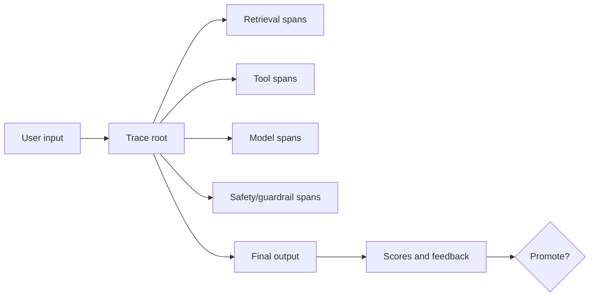

# LLMOps Evaluation Scorecard

Use this template as a promotion gate for prompts, retrieval configs, model versions, adapters, tools, or workflow changes.

## Change Under Review

Change type: Prompt / Model / Adapter / Retrieval / Tool / Workflow / Runtime

Owner:

Version:

Rollback target:

## Evaluation Inputs

| Input | Version / Link | Owner |
| --- | --- | --- |
| Evaluation dataset |  |  |
| Prompt version |  |  |
| Model or adapter |  |  |
| Retrieval config |  |  |
| Tool policy |  |  |
| Runtime config |  |  |

## Scorecard

| Dimension | Metric | Baseline | Candidate | Threshold | Pass |
| --- | --- | --- | --- | --- | --- |
| Task success |  |  |  |  |  |
| Groundedness |  |  |  |  |  |
| Citation quality |  |  |  |  |  |
| Safety/policy |  |  |  |  |  |
| Latency |  |  |  |  |  |
| Cost |  |  |  |  |  |
| Tool correctness |  |  |  |  |  |
| Regression count |  |  |  |  |  |

## Trace Requirements

Required trace fields:

- User/session ID policy.
- Prompt version.
- Model/runtime version.
- Retrieval config version.
- Tool names and inputs/outputs.
- Scores and evaluator versions.
- Cost and latency.

## Promotion Decision

Decision: Promote / Hold / Reject

Reason:

Follow-up work:

## Review Checklist

- [ ] Candidate beats or matches baseline on required dimensions.
- [ ] Any quality improvement is not offset by unacceptable cost/latency/security regression.
- [ ] Human review covers high-risk examples.
- [ ] Rollback target is tested.
- [ ] Traces are sufficient for post-release incident review.

## Evaluation Design Notes

Evaluation should represent the product risk, not just a convenient sample of prompts. Include common successful tasks, difficult edge cases, ambiguous requests, adversarial prompts, stale knowledge requests, retrieval misses, tool failures, and policy-sensitive scenarios. For RAG systems, include questions that should be answered, questions that should be refused, and questions that require citations from multiple sources. For agents, include tool permission boundaries, invalid tool arguments, partial failures, and handoff mistakes.

Use a baseline for every promotion decision. The baseline can be the current production prompt, the previous retrieval configuration, the prior model version, or a simpler workflow. Without a baseline, the team cannot distinguish improvement from noise. Track evaluator versions as carefully as prompt and model versions, because a changed evaluator can make historical comparisons misleading.

## Release Policy

Promote only when the candidate passes required quality thresholds and does not introduce unacceptable regressions in cost, latency, safety, or operational complexity. A candidate that improves answer quality but doubles cost may still be rejected if the product cannot absorb the change. A candidate that improves average quality but fails high-risk compliance examples should be held until the failure mode is understood.

After release, keep monitoring the same dimensions. Production traffic may reveal prompt distributions and retrieval patterns that the offline dataset missed. Feed incidents, user corrections, low-confidence traces, and support escalations back into the evaluation set. The scorecard should become a living promotion gate, not a one-time launch document.
