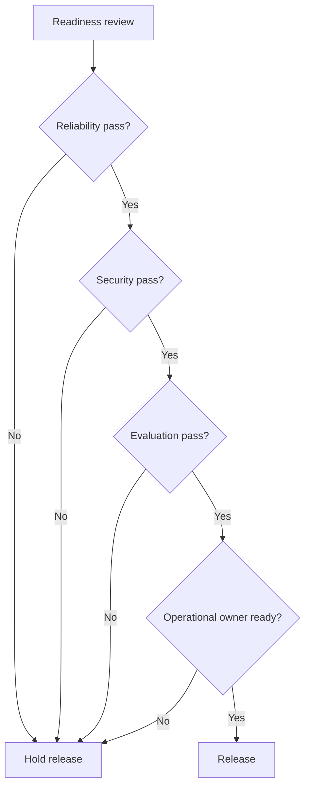

# Production Readiness Checklist

Use this checklist before an AI solution goes live.

## Ownership

- [ ] Product owner named.
- [ ] Engineering owner named.
- [ ] Runtime/on-call owner named.
- [ ] Data owner named.
- [ ] Security/governance reviewer named.

## Architecture Boundaries

- [ ] User workflow is documented.
- [ ] Agent/workflow/retrieval boundaries are clear.
- [ ] Runtime boundary is clear.
- [ ] Data plane boundary is clear.
- [ ] Tool side effects are isolated and governed.

## Reliability

- [ ] p95/p99 latency targets are defined.
- [ ] Capacity model includes prompt and completion token distribution.
- [ ] Fallback behavior is defined.
- [ ] Retry and timeout policy is tested.
- [ ] Rollback path exists.
- [ ] Incident runbook exists.

## Data And Retrieval

- [ ] Data sources are approved.
- [ ] Chunking and embedding versions are tracked.
- [ ] Access control is enforced during retrieval.
- [ ] Deletion and update workflows are tested.
- [ ] Retrieval eval passes.

## Evaluation

- [ ] Evaluation dataset exists.
- [ ] Baseline and candidate results are compared.
- [ ] Safety and policy evaluations are included.
- [ ] Human review covers high-risk cases.
- [ ] Promotion gate owner signs off.

## Security And Governance

- [ ] Secrets are not exposed in prompts, traces, logs, or tools.
- [ ] Tool execution uses least privilege.
- [ ] Audit logs capture high-impact actions.
- [ ] PII redaction/retention policy is defined.
- [ ] Model artifact provenance is tracked.
- [ ] External providers meet data policy requirements.

## Observability

- [ ] Traces include model calls, retrieval, tools, scores, and errors.
- [ ] Dashboards cover latency, cost, errors, retrieval quality, and safety events.
- [ ] Alerts are configured.
- [ ] Post-incident review process exists.

## Final Gate

## Review Method

Run this checklist as a cross-functional review with product, engineering, data, security, and operations represented. The purpose is to decide whether the solution can be operated, not whether the prototype is impressive. Each unchecked item should have an owner, a due date, and a release impact. Some items can be accepted as known risks, but only when the decision is explicit and the mitigation is understood.

The strongest readiness reviews use evidence from the other templates. The ADR explains why the architecture exists. The runtime matrix proves that serving constraints are understood. The RAG data contract proves that retrieval quality and data governance have owners. The LLMOps scorecard proves that prompt, model, retrieval, and tool changes have promotion gates. The security review proves that access, audit, and sensitive data controls are not afterthoughts.

## Common Release Blockers

Common blockers include missing rollback paths, untested provider outages, no owner for evaluation datasets, unclear trace retention policy, secrets visible in prompts or logs, retrieval that bypasses tenant access control, tool calls without approval gates, and dashboards that only show infrastructure metrics while ignoring answer quality and cost. Treat these as architecture issues, not cleanup tasks, because they directly affect production trust.
