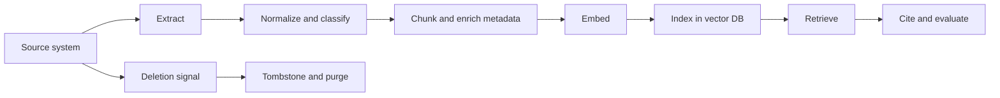

# RAG Data Contract

Use this template before building ingestion or retrieval. RAG failures are usually data architecture failures, not only prompt failures.

## Scope

Product/workflow:

Users:

Retrieval use cases:

Out-of-scope data:

## Document Contract

| Field | Description | Required | Example |
| --- | --- | --- | --- |
| document_id | Stable source document ID | Yes |  |
| source_uri | Source system/path | Yes |  |
| owner | Business or system owner | Yes |  |
| access_policy | ACL/role/tenant metadata | Yes |  |
| version | Source document version | Yes |  |
| effective_date | Date content becomes valid | Optional |  |
| retention_policy | Deletion/archival rule | Yes |  |

## Chunk Contract

| Field | Description | Required | Example |
| --- | --- | --- | --- |
| chunk_id | Stable chunk ID | Yes |  |
| document_id | Parent document ID | Yes |  |
| chunk_text | Text sent to embedding model | Yes |  |
| chunk_order | Position in document | Yes |  |
| section_title | Heading or logical section | Optional |  |
| token_count | Token length | Yes |  |
| embedding_model | Embedding model ID | Yes |  |
| embedding_version | Embedding config version | Yes |  |

## Query Contract

| Element | Decision |
| --- | --- |
| Query rewrite policy |  |
| Top-k |  |
| Hybrid search |  |
| Metadata filters |  |
| Reranker |  |
| Citation format |  |
| Low-confidence threshold |  |
| Access control enforcement point |  |

## Lifecycle

## Retrieval Evaluation

| Test | Purpose | Pass Criteria |
| --- | --- | --- |
| Golden query set | Measures retrieval relevance |  |
| Citation audit | Checks evidence is cited correctly |  |
| Permission test | Ensures user sees only allowed chunks |  |
| Freshness test | Ensures updates and deletes propagate |  |
| Drift test | Detects embedding/chunking regression |  |

## Readiness Checklist

- [ ] Embedding model and version are recorded.
- [ ] Metadata schema supports filtering and governance.
- [ ] Deletion workflow is tested.
- [ ] Tenant/access control is enforced before generation.
- [ ] Retrieval quality is evaluated independently from answer quality.
- [ ] Low-confidence behavior is defined.
