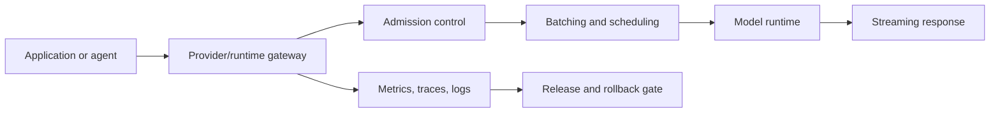

# Runtime Decision Matrix

Use this template when choosing how to serve a model.

## Candidate Runtimes

| Runtime | Best Fit | Watch For |
| --- | --- | --- |
| Hosted API | Fast product validation and managed operations | Provider lock-in, cost, data policy, rate limits |
| Transformers | Compatibility, experimentation, model API baseline | Serving efficiency, memory, throughput |
| vLLM | High-throughput GPU serving and OpenAI-compatible APIs | GPU memory, scheduler behavior, model support |
| llama.cpp | Local, edge, CPU/GPU hybrid, quantized inference | Quantization quality, conversion, context limits |
| Hybrid Gateway | Multi-provider routing and fallback | Routing policy, observability, consistency |

## Requirements

| Requirement | Target | Hard / Soft | Notes |
| --- | --- | --- | --- |
| p50 latency |  |  |  |
| p95 latency |  |  |  |
| Concurrent users |  |  |  |
| Tokens per second |  |  |  |
| Context length |  |  |  |
| Streaming |  |  |  |
| Deployment target |  |  |  |
| Cost ceiling |  |  |  |
| Data policy |  |  |  |

## Evaluation Matrix

| Criterion | Weight | Hosted API | Transformers | vLLM | llama.cpp | Notes |
| --- | --- | --- | --- | --- | --- | --- |
| Latency |  |  |  |  |  |  |
| Throughput |  |  |  |  |  |  |
| Memory efficiency |  |  |  |  |  |  |
| Model compatibility |  |  |  |  |  |  |
| Operational simplicity |  |  |  |  |  |  |
| Observability |  |  |  |  |  |  |
| Security posture |  |  |  |  |  |  |
| Cost |  |  |  |  |  |  |

## Serving Architecture

## Promotion Gate

- [ ] Load test includes expected prompt lengths and output lengths.
- [ ] Streaming behavior is tested.
- [ ] Model artifact provenance is recorded.
- [ ] Rollback target is available.
- [ ] Cost and quota alarms are configured.
- [ ] p95/p99 latency is acceptable.
- [ ] Error handling is tested for provider/runtime failures.

## Scoring Guidance

Score each runtime against the real workload rather than against generic popularity. A hosted API can be the best decision for early product validation when managed reliability and fast iteration matter more than low-level control. vLLM can be the best decision when GPU throughput, continuous batching, and OpenAI-compatible serving are important. Transformers can be the best baseline for experimentation and model compatibility. llama.cpp can be strong for local, edge, constrained, or quantized deployments. A hybrid gateway can be valuable when the system needs routing, fallback, policy enforcement, or provider abstraction.

Weights should reflect the product stage. During discovery, operational simplicity and iteration speed may dominate. During scale-up, throughput, cost per token, latency distribution, and quota planning become more important. For regulated systems, data policy, auditability, provider contract terms, and deployment residency can outweigh raw speed.

## Benchmark Plan

Run benchmarks with production-shaped prompts. Include short requests, long-context requests, retrieval-augmented prompts, streaming responses, tool-call prompts, and worst-case completion lengths. Capture cold start behavior, steady-state throughput, memory pressure, queue time, token generation rate, error rate, and retry behavior. If the runtime is GPU-based, record GPU model, memory size, tensor parallel settings, batch configuration, context length, quantization format, and scheduler parameters.

Do not promote a runtime from synthetic throughput alone. A serving decision is only defensible when quality, latency, cost, observability, security, and rollback have all been checked. The winner should be the runtime that best satisfies the operating envelope, not the runtime with the most impressive isolated benchmark.
