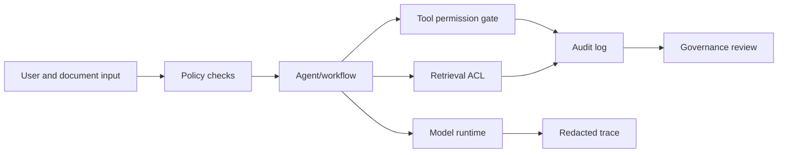

# Security And Governance Review

Use this template for systems with agents, tools, retrieval, model artifacts, or LLMOps traces.

## Scope

System:

Reviewer:

Date:

Data classification:

## Threat Model

| Entry Point | Untrusted Input? | Risk | Control |
| --- | --- | --- | --- |
| User prompt |  | Prompt injection / data leakage |  |
| Retrieved documents |  | Indirect prompt injection |  |
| Tool inputs |  | Unauthorized action |  |
| Model artifacts |  | Unsafe code/artifact |  |
| Traces/logs |  | PII/secrets exposure |  |
| Admin UI |  | Privilege escalation |  |

## Tool Governance

| Tool | Allowed Users | Allowed Actions | Approval Required | Audit Event |
| --- | --- | --- | --- | --- |
|  |  |  |  |  |

## Data Governance

- [ ] Data sources are approved.
- [ ] PII policy is defined.
- [ ] Retention policy is defined.
- [ ] Tenant isolation is tested.
- [ ] Retrieval access control is tested.
- [ ] Traces redact sensitive values.

## Model And Artifact Governance

- [ ] Model source is trusted.
- [ ] Remote code policy is defined.
- [ ] Adapter/checkpoint format is approved.
- [ ] Artifact checksum/provenance is recorded.
- [ ] Rollback artifact exists.

## Control Map

## Decision

Decision: Approved / Approved with conditions / Blocked

Conditions:

- 

Review date:

## Review Method

Review the system from every untrusted input boundary. User prompts are untrusted. Retrieved documents are untrusted because they can contain indirect prompt injection. Tool outputs are untrusted because upstream systems can fail or return manipulated content. Model artifacts are untrusted until provenance and loading behavior are verified. Traces and logs are sensitive because they can contain prompts, retrieved content, tool arguments, identifiers, and model outputs.

For each boundary, identify the control that prevents accidental or malicious escalation. Controls can include retrieval access checks, tool allowlists, approval workflows, argument validation, rate limits, output filtering, secret redaction, audit logging, tenant isolation, artifact checksums, and restricted runtime permissions. A control is only credible when it has an owner and a way to verify it.

## High-Risk Questions

- Can a user or retrieved document cause the agent to call a tool outside the intended scope?
- Can retrieved content override system instructions or leak data from another tenant?
- Are secrets ever included in prompts, tool outputs, traces, screenshots, or debug logs?
- Can a model artifact execute remote code or load untrusted files during startup?
- Are administrative actions separated from ordinary user actions?
- Can the team reconstruct who approved or executed a high-impact tool call?
- Are retention, deletion, and redaction policies applied consistently across traces, vector stores, logs, and analytics exports?

## Approval Standard

Approve only when the review can point to concrete controls, not only policy statements. Approve with conditions when a control is missing but the risk is bounded and a mitigation owner exists. Block when the system can exfiltrate data, execute unsafe tools, bypass tenant isolation, expose secrets, or produce high-impact actions without traceable approval.
